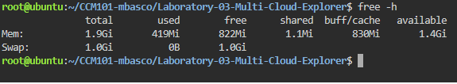
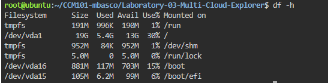
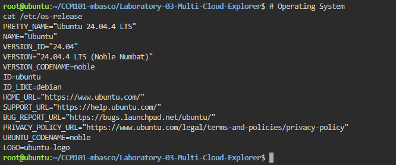
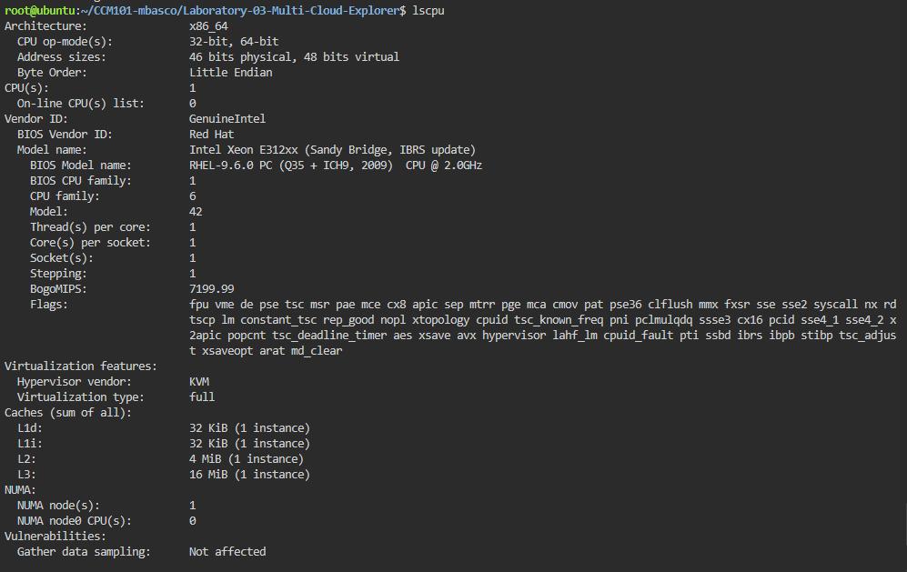

Checkpoint 7 – Continue Your Linux Investigation

Linux Server Investigation

The Linux server was investigated using the KillerCoda Playground. Linux commands were used to identify the operating system, CPU information, memory, and disk space.

Operating System

Command Used:
cat /etc/os-release

Result:
Ubuntu 24.04.4 LTS (Noble Numbat)

The server is running Ubuntu 24.04.4 LTS, a Linux-based operating system.

CPU Information

Command Used:
lscpu

Result:
Architecture: x86_64
CPU(s): 1
Model: Intel Xeon E312xx (Sandy Bridge, IBRS update)
CPU Frequency: 2.0 GHz
Virtualization: KVM

The server has one virtual CPU using an Intel Xeon processor. The system uses x86_64 architecture and operates inside a KVM virtualized environment.

Memory

Command Used:
free -h

Result:
Total Memory: 1.9 GiB
Used Memory: 419 MiB
Free Memory: 822 MiB
Available Memory: 1.4 GiB
Swap: 1.0 GiB

The Linux server has 1.9 GiB of RAM and 1.0 GiB of swap space. Approximately 1.4 GiB of RAM is available for applications and system processes.

Disk Space

Command Used:
df -h

Result:
Device: /dev/vda1
Total Size: 19G
Used: 5.4G
Available: 13G
Usage: 30%
Mount Point: /

The main Linux file system uses a 19 GB virtual disk. Approximately 5.4 GB is currently used and 13 GB remains available.

Cloud Migration Options

If this Linux server were migrated to the cloud, it could be hosted using virtual machine services from AWS, Microsoft Azure, or Google Cloud.

AWS

Recommended Service: Amazon EC2

Amazon EC2 can host the Ubuntu Linux server as a virtual machine. The server configuration can be adjusted based on CPU, memory, storage, networking, and application requirements.

Azure

Recommended Service: Azure Virtual Machines

Azure Virtual Machines can host Ubuntu Linux workloads in Microsoft's cloud infrastructure. The virtual machine can be configured with the required CPU, memory, disk, networking, and security settings.

Google Cloud

Recommended Service: Google Compute Engine

Google Compute Engine can host the Ubuntu Linux server as a cloud-based virtual machine. The required CPU, memory, storage, and networking resources can be selected according to the workload.

Cloud Service Comparison

| Cloud Provider | Service | Purpose |
|----------------|---------|---------|
| AWS | Amazon EC2 | Hosts Ubuntu and other Linux virtual machines |
| Microsoft Azure | Azure Virtual Machines | Hosts Ubuntu and other Linux virtual machines |
| Google Cloud | Google Compute Engine | Hosts Ubuntu and other Linux virtual machines |

Migration Recommendation

All three major cloud providers can host this Linux server because AWS, Azure, and Google Cloud support Ubuntu virtual machines.

For AWS, Amazon EC2 would be used. For Microsoft Azure, Azure Virtual Machines would be used. For Google Cloud, Google Compute Engine would be used.

The final choice would depend on the organization's existing cloud environment, pricing, required services, security requirements, performance, and scalability needs.

Terminal Screenshots

Screenshot 1 – Operating System

The screenshot shows the output of the cat /etc/os-release command identifying Ubuntu 24.04.4 LTS.

Screenshot 2 – CPU Information

The screenshot shows the output of the lscpu command identifying the x86_64 architecture, one CPU, and the Intel Xeon E312xx processor.

Screenshot 3 – Memory Information

The screenshot shows the output of the free -h command showing 1.9 GiB of total memory.

Screenshot 4 – Disk Space

The screenshot shows the output of the df -h command showing the 19 GB /dev/vda1 disk with 13 GB available.

## Terminal Screenshots

### Screenshot 1 – Operating System

The screenshot shows the output of the `cat /etc/os-release` command identifying Ubuntu 24.04.4 LTS.

### Screenshot 2 – CPU Information

The screenshot shows the output of the `lscpu` command identifying the x86_64 architecture, one CPU, and the Intel Xeon E312xx processor.

### Screenshot 3 – Memory Information

The screenshot shows the output of the `free -h` command showing 1.9 GiB of total memory.

### Screenshot 4 – Disk Space

The screenshot shows the output of the `df -h` command showing the 19 GB `/dev/vda1` disk with 13 GB available.

