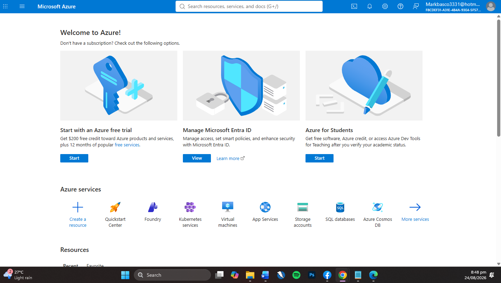

Microsoft Azure Research

Overview

Microsoft Azure is a cloud computing platform developed by Microsoft. Azure provides cloud services that allow organizations to build, deploy, operate, and manage applications and infrastructure.

Azure supports cloud, hybrid, and edge environments and provides services for computing, storage, networking, databases, security, analytics, artificial intelligence, and application development.

Major Azure Services

1. Azure Virtual Machines

Azure Virtual Machines provide scalable virtual computers running in Microsoft's cloud infrastructure.

Purpose: Hosting applications, servers, and workloads in the cloud.

2. Azure Blob Storage

Azure Blob Storage is an object storage service designed to store large amounts of unstructured data.

Purpose: Storing documents, images, videos, backups, and other files.

3. Azure SQL Database

Azure SQL Database is a managed relational database service based on Microsoft SQL Server technologies.

Purpose: Hosting and managing relational databases in the cloud.

4. Azure Functions

Azure Functions is a serverless computing service that allows developers to execute code in response to events without managing servers.

Purpose: Automation, APIs, background processing, and event-driven applications.

5. Azure Virtual Network

Azure Virtual Network provides private networking capabilities for Azure resources.

Purpose: Connecting virtual machines, applications, and other cloud resources securely.

Azure Benefits

Flexible cloud infrastructure
Global scalability
Hybrid cloud support
Security and compliance features
Integration with Microsoft technologies
Artificial intelligence and machine learning services
Managed databases
Serverless computing
Enterprise management tools

Azure Use Cases

Website hosting
Application development
Virtual machines
Database management
Cloud storage
Backup and disaster recovery
Artificial intelligence
Data analytics
Hybrid cloud infrastructure
Enterprise applications

Azure Importance to System Administration

Azure provides tools that allow system administrators to manage virtual machines, networks, storage, databases, identities, security policies, and cloud resources.

Conclusion

Microsoft Azure is a major cloud computing platform that provides infrastructure, platform, data, AI, networking, security, and management services.

SCREENSHOT

Official Sources

Microsoft Azure: https://azure.microsoft.com/
Azure Overview: https://azure.microsoft.com/en-us/explore
Azure Documentation: https://learn.microsoft.com/azure/
